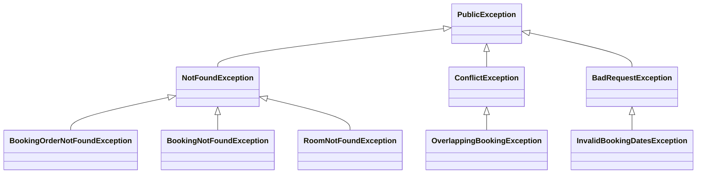

# 🏨 Booking API

Una API de reservas de habitaciones diseñada como prueba técnica personal. Esta aplicación simula un sistema real de gestión de reservas para hoteles, con enfoque en buenas prácticas, principios de arquitectura moderna y capacidades de observabilidad y mensajería.

---

## ✨ ¿Qué problema resuelve?

El sistema permite a un hotel llevar control de:

- **Habitaciones disponibles**
- **Órdenes de reserva entrantes (solicitudes aún no confirmadas)**
- **Reservas confirmadas**
- **Prevención de conflictos por fechas superpuestas**
- **Emisión de eventos para procesamiento asíncrono**

---

## ⚙️ Arquitectura y diseño

Esta API fue desarrollada siguiendo una arquitectura **limpia (Clean Architecture)**, aplicando los principios de **DDD**, **event-driven design** y **microservicios desacoplados**.

### 🧱 Capas principales

- **Dominio**: Entidades, repositorios, eventos de dominio y excepciones
- **Aplicación**: Servicios de negocio que orquestan lógica de dominio
- **Infraestructura**: Repositorios, serializadores, excepciones técnicas y emisores Kafka
- **Entrypoints**: Controladores REST

### 📜 Excepciones y jerarquía



## 🔌 Endpoints
### 📘 Swagger UI
Disponible en: http://localhost:8080/q/swagger-ui

### 🛏️ Habitaciones
| Método | Ruta        | Descripción                |
|--------|-------------|----------------------------|
| POST   | /rooms      | Crear una nueva habitación |
| GET    | /rooms      | Listar habitaciones        |
| GET    | /rooms/{id} | Obtener habitación por id  |

### 📦 Órdenes de reserva (no confirmadas)
| Método | Ruta                 | Descripción                |
|--------|----------------------|----------------------------|
| POST   | /booking-orders      | Crear una orden de reserva |
| GET    | /booking-orders      | Listar órdenes de reserva  |
| GET    | /booking-orders/{id} | Obtener orden por ID       |

### 📅 Reservas confirmadas
| Método | Ruta           | Descripción                |
|--------|----------------|----------------------------|
| GET    | /bookings      | Listar reservas            |
| GET    | /bookings/{id} | Obtener una reserva por id |

## 🚀 Cómo ejecutar el proyecto
### ✅ Requisitos
- Docker & Docker Compose
- JDK 17+
- Maven

### 📦 Compilar el proyecto
``` bash
./mvnw clean package
````
### 🐳 Levantar entorno completo (API + Kafka + Prometheus + Grafana)
``` bash
docker compose up
```
La API estará disponible en http://localhost:8080

## 📈 Observabilidad
### 🔎 Prometheus
- Endpoint de métricas: http://localhost:8080/q/metrics
- Interfaz Prometheus: http://localhost:9090

### 📊 Grafana
- Interfaz: http://localhost:3000
- Usuario/contraseña: admin / admin
- Dashboards: incluye uno con métricas de Quarkus y personalizadas

## 🎯 Métricas personalizadas
Todos los servicios de negocio (RoomService, BookingService, etc.) incluyen anotaciones con:
- @Counted: número de ejecuciones
- @Timed: tiempo de ejecución
- Con nombre y descripción clara (ej: booking_confirmed_total)

## 🧪 Tests
- Todos los servicios están cubiertos con pruebas unitarias usando Mockito (@InjectMock)
- No se mockea Kafka directamente, ya que se separó la responsabilidad de emitir eventos
- Validaciones realizadas con Bean Validation (@Valid, @NotNull, @Size, etc.)

## 🧱 Tecnologías utilizadas
- Quarkus
- Kafka (Redpanda Console)
- JPA con Hibernate
- Micrometer (métricas Prometheus)
- Swagger/OpenAPI
- Grafana y Prometheus
- Docker & Docker Compose

## 🧠 Consideraciones finales
- Diseñado como prueba técnica personal con enfoque profesional
- Fuerte separación de capas y responsabilidades
- Basado en buenas prácticas reales de proyectos empresariales